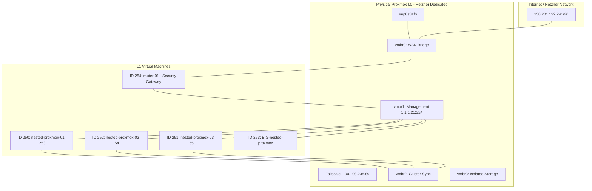

```markdown
# Hybrid Cloud Lab: Nested Virtualization & Security Gateway

## 🚀 Overview

This repository contains the architectural design, network configuration, and automation scripts for a **Nested Proxmox Cluster** deployed on a Hetzner Dedicated server. It showcases advanced skills in **Layer 3 networking**, **firewall automation**, and **enterprise-grade virtualization**.

## 🛠 Technology Stack

- **L0 Hypervisor:** Proxmox VE (Physical)
- **L1 Compute:** 4x Nested Proxmox Nodes (High-Availability Cluster)
- **Networking:** Iptables (Stateful Firewall), WireGuard (VPN), Tailscale (OOB Management)
- **Monitoring:** Zabbix (Active/Passive Agent Integration)
- **OS:** Debian/Fedora/Windows Server (DC)

---

## 📊 Lab Topology

The diagram below illustrates the flow from the public Internet through the security gateway to the isolated nested segments.



---

## 🌐 Networking & Segmentation

| Segment | Network ID | Interface | Purpose |
| --- | --- | --- | --- |
| **WAN** | `138.201.192.x` | `ens18` | Public Egress / External Access |
| **MGMT** | `1.1.1.0/24` | `ens19` | Infrastructure & Proxmox GUI Management |
| **DC** | `192.168.0.0/24` | `ens20` | Internal Workloads (Active Directory, Zabbix) |
| **VPN** | `10.10.10.0/24` | `wg0` | Encrypted Administrative Access |

---

## 🛡️ Firewall Automation

The core of the security gateway is managed via a custom Bash script (`apply_firewall.sh`) found in the `scripts/router/` directory.

### Key Features:

- **Stateful Inspection:** Default `DROP` policy with granular `ACCEPT` rules.
- **Dynamic Whitelisting:** Uses `ipset` to manage trusted source IPs.
- **Port Forwarding:** Maps external ports to nested Proxmox nodes (e.g., WAN:984 → NodeB:8006).
- **MTU Optimization:** Implements TCP MSS Clamping to ensure stable traffic through nested tunnels and VPN interfaces.

---

## 📝 Implementation Highlights

### 1. Nested Virtualization Tweak

To allow L1 Proxmox nodes to host their own VMs, the L0 host is configured to expose hardware-assisted virtualization:

```bash
# Example configuration on L0 for nested nodes
args: -cpu host,kvm=on
```

### 2. Zabbix Monitoring Integration

The firewall allows specific traffic for Zabbix (Ports `10050/10051`) between the Data Center segment and the Management segment, enabling full-stack visibility of both physical and virtual layers.

---

## 📂 Repository Structure

Explore the folders for detailed scripts, architecture diagrams, and documentation.

- `architecture/`: High-resolution diagrams and network maps.
- `scripts/router/`: Firewall and routing automation scripts.
- `scripts/automation/`: Additional automation scripts.
- `docs/`: Implementation notes and usage guides.

---

## 📜 License

This project is licensed under the [MIT License](LICENSE). Feel free to use, modify, and share!

---

**Author:** Konrad Kałuszyński  
**Role:** IT Systems Engineer / L3 Support Engineer  
**Status:** Active Lab Environment  
```

